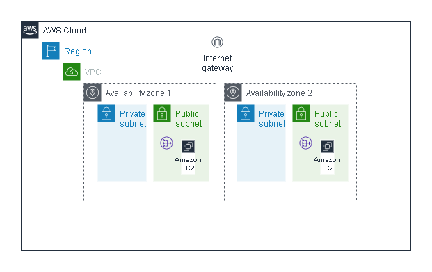

# Build highly available infrastructure using Terraform

This project involved the creation of a virtual private cloud (VPC) and associated infrastructure using the Infrastructure as Code tool, Terraform. The aim was to create a reliable and scalable environment to host a static website. To achieve this, I first created a VPC and then created subnets in two different availability zones. I also set up a NAT gateway and an internet gateway to enable communication between the VPC and the internet. In addition, I created EC2 instances in each of the subnets, with Apache server installed using user data scripts to host the static website.

## Architecture

